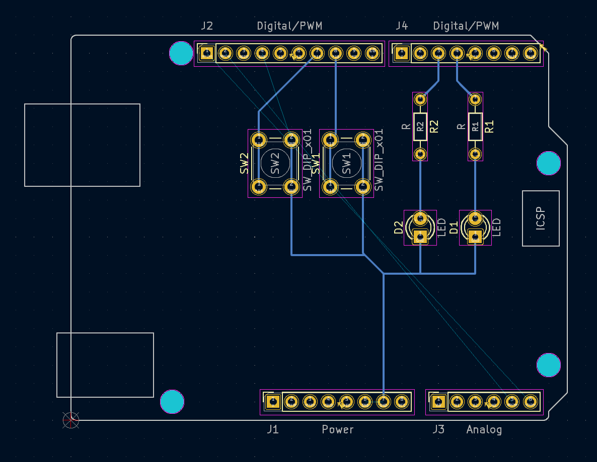
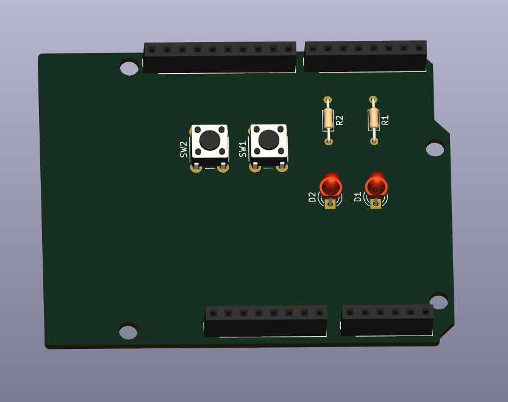
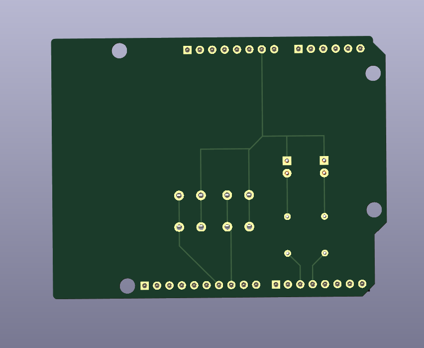

# KiCad_Practice

[유튜브 강의](https://www.youtube.com/watch?v=MrIUESCI15k&list=PLj5NnUk28LOecGFEXqgYY5xdjfHh7dqTh)를 참고하여 KiCad(카이캐드)실습   
 
강의는 총 15편으로 이루어져 있으며 마지막에는 PCB기판을 주문하는 것을 목적으로 하는 **<u>공부</u>**를 진행.   
***
### Exam PCB Img

  
### Exam 3D Front Img

  
### Exam 3D Back Img

